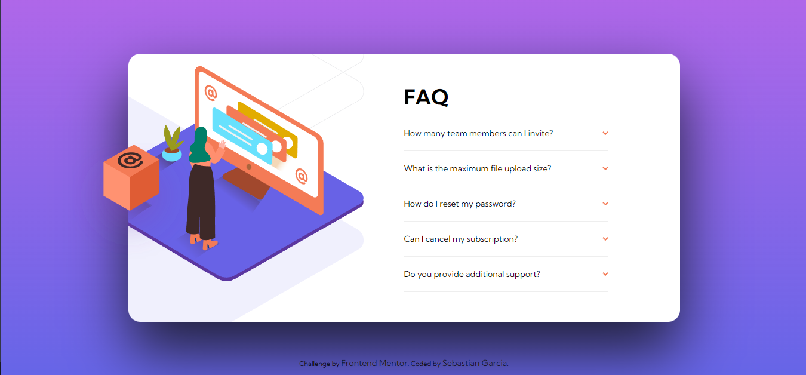

# Frontend Mentor - FAQ accordion card solution

This is a solution to the [FAQ accordion card challenge on Frontend Mentor](https://www.frontendmentor.io/challenges/faq-accordion-card-XlyjD0Oam). Frontend Mentor challenges help you improve your coding skills by building realistic projects. 

## Table of contents

- [Overview](#overview)
  - [The challenge](#the-challenge)
  - [Screenshot](#screenshot)
  - [Links](#links)
- [My process](#my-process)
  - [Built with](#built-with)
  - [What I learned](#what-i-learned)
- [Author](#author)


## Overview

### The challenge

Users should be able to:

- View the optimal layout for the component depending on their device's screen size
- See hover states for all interactive elements on the page
- Hide/Show the answer to a question when the question is clicked

### Screenshot



### Links

- Solution URL: [Add solution URL here](https://github.com/SebastianFGarcia/FAQ-accordion-card)
- Live Site URL: [Add live site URL here](https://sebastianfgarcia.github.io/FAQ-accordion-card/)

## My process

### Built with

- Semantic HTML5 markup
- CSS custom properties
- Flexbox
- CSS Grid
- Mobile-first workflow

### What I learned

```html
<details class="details">
  <summary class="summary">
    How many team members can I invite?
    
  </summary>
  <p class="p">
    You can invite up to 2 additional users on the Free plan. There is no limit on team members for the Premium plan.
  </p>
</details>
```
```css
.container{
  overflow: hidden;
  width: 924px;
  display: grid;
  grid-template-columns: 50% 50%;
}
```

## Author

- Frontend Mentor - [@yourusername](https://www.frontendmentor.io/profile/SebastianFGarcia)


